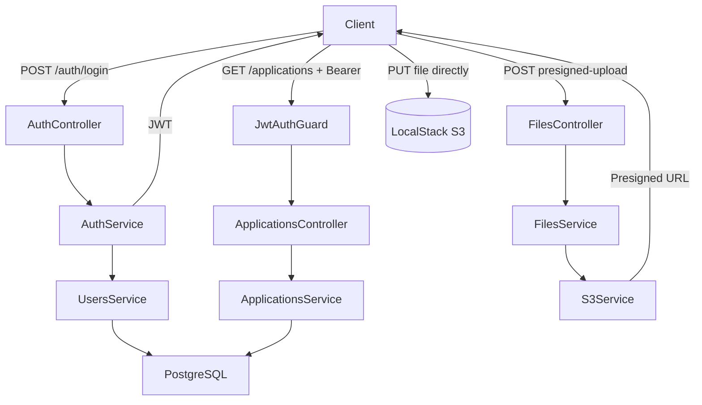

# Job Application Tracker API

This Application is a backend part for job tracking system. It was made at times when I am actively looking for a new role. 
In the same time it's a pet project to refresh my backend skills and fill gaps in this area.

## Tech Stack
### Backend
- **Nest.js** (latest stable) — module-based Node.js framework with built-in DI
- **TypeScript** strict mode
- **Prisma ORM** — type-safe database access with auto-generated client
- **PostgreSQL** — relational database
- **JWT authentication** (passport-jwt) with auth guard
- **class-validator** — declarative DTO validation
- Custom logging interceptor with request timing

### Storage:
- AWS S3 for storing CV/cover letter PDF
- Presigned URLs pattern (the most user production pattern for the frontend)
- AWS SDK v3 in TypeScript
- LocalStack for the local development

### Infrastructure
- Docker + docker-compose (Postgres + LocalStack)
- Multi-stage Dockerfile
- .env.example

### Quality
- ESLint + Prettier
- Jest unit tests

### CI/CD
- GitHub Actions:
    - lint job
    - type-check job
    - test job
    - runs on push and pull_request
- deploy - will be added later

## What This Demonstrates

- **Nest.js module architecture** — each feature (auth, applications, files) is an isolated module with its own controller, service, and DI scope; modules declare what they expose and what they depend on
- **JWT authentication flow** — stateless auth with `passport-jwt` strategy, custom `JwtAuthGuard`, and bcrypt password hashing; no sessions, no server-side state
- **Presigned S3 URL pattern** — file uploads go directly from the client to S3; the API only issues a time-limited signed URL and records metadata, keeping file traffic off the server entirely
- **Type-safe database access** — Prisma generates a fully-typed client from the schema; invalid field access or missing relations are caught at compile time, not runtime
- **Separation of concerns** — controllers handle HTTP (parsing, status codes), services own business logic, guards handle auth; no business logic leaks into the HTTP layer

## Architecture



## Getting Started

### Prerequisites

- Node.js 20+
- Docker and Docker Compose

### Installation & Running Locally

```bash
# 1. Clone the repository
git clone https://github.com/VestryOd/job-tracker-api.git
cd job-tracker-api

# 2. Install dependencies
npm install

# 3. Configure environment
cp .env.example .env
# Fill in the values in .env (see .env.example for reference)

# 4. Start PostgreSQL
docker compose up -d

# 5. Run database migrations
npx prisma migrate dev

# 6. Start the development server
npm run start:dev
```

The API will be available at `http://localhost:3000`.

## API Overview

| Method | Endpoint | Auth | Description |
|--------|----------|------|-------------|
| POST | `/auth/register` | — | Register a new user |
| POST | `/auth/login` | — | Login and receive JWT |
| GET | `/applications` | Bearer | List all job applications |
| POST | `/applications` | Bearer | Create a new application |
| GET | `/applications/:id` | Bearer | Get a single application |
| PATCH | `/applications/:id` | Bearer | Update an application |
| DELETE | `/applications/:id` | Bearer | Delete an application |
| POST | `/files/presigned-upload` | Bearer | Get a presigned S3 URL for file upload |

Full interactive docs are available via Swagger at `http://localhost:3000/api` when the server is running.

## Running Tests

```bash
# Unit tests
npm run test

# Unit tests with coverage
npm run test:cov

# End-to-end tests
npm run test:e2e
```